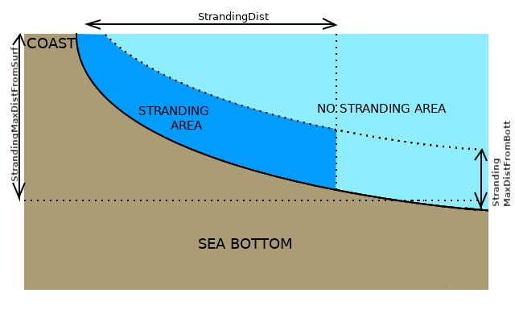

# LTRANS-Zlev : User Manual

*C. Laurent, 2019*, v.0 (beta) https://github.com/inogs/LTRANS_Zlev

The present manual consists of a guide detailing the options and setup instructions that are specific to the Zlev version of LTRANS. For this reason, the user should refer to the original v.2b publications and user guide for the options and setup instructions that are in common between the versions, and for details about the methods implemented. More details are given in section 1.1. Users of LTRANS with the OILTRANS oil spill module can find details on the methods implemented in the OilSpill module in the reference cited section 1.2. 

Users should make reference to the following article relative to the present Zlev version:

> [C. Laurent, S. Querin, C. Solidoro, D. Melaku Canu. 2020. "Modelling marine particle dynamics with LTRANS-Zlev: implementation and validation", Environmental Modelling & Software 125, 104621.
](https://www.sciencedirect.com/science/article/pii/S1364815219305304) 

For any issue relative to the present version of the software, the users can write to : **claurent@inogs.it**

### 1. Materials of the original LTRANS code

#### 1.1 The LTRANS v.2b version

This user manual is an integration of the original user manual provided by the developers of the v.2b version, available at the address https://github.com/LTRANS/LTRANSv.2b/blob/master/LTRANSv2_UsersGuide_6Jan12.pdf.

The original LTRANS v.2b web page is: http://northweb.hpl.umces.edu/LTRANS.htm; it contains the code and instructions as well as grids, hydrodynamic fields and input files to test the v.2b version on a ROMS sigma coordinates domain. The LTRANS v.2b updated source code can be found in https://github.com/LTRANS/LTRANSv.2b . The materials provided by the LTRANS v.2b authors at these addresses provide instructions to install the netcdf and hdf5 external libraries as well as information regarding two proprietary programs used by LTRANS that require particular permissions if employed for commercial use. 

- **Mersenne Twister random number generator**
- **TSPACK: tension spline curve-fitting package**

Note that the use of TSPACK can be deactivated in the Zlev version.

The code structure and algorithms presented in **section I of the LTRANS v.2b user guide** (https://github.com/LTRANS/LTRANSv.2b/blob/master/LTRANSv2_UsersGuide_6Jan12.pdf) provide a complete overview of the original version of the code.

The use of the Zlev version relays on dependencies to the same libraries as the original v.2b version; the user can have detailed instructions on their set-up in **section II of the LTRANS v.2b user guide** (https://github.com/LTRANS/LTRANSv.2b/blob/master/LTRANSv2_UsersGuide_6Jan12.pdf)

Users of LTRANS should make reference to the following papers and User's Guide:

> North, E. W., E. E. Adams, Z. Schlag, C. R. Sherwood, R. He, S.  Socolofsky. 2011. Simulating oil droplet dispersal from the Deepwater  Horizon spill with a Lagrangian approach. AGU Book Series: Monitoring  and Modeling the Deepwater Horizon Oil Spill: A Record Breaking  Enterprise  [link to paper](http://onlinelibrary.wiley.com/doi/10.1029/2011GM001102/summary)
>
> North, E. W., Z. Schlag, R. R. Hood, M. Li, L. Zhong, T. Gross, and  V. S. Kennedy. 2008. Vertical swimming behavior influences the dispersal  of simulated oyster larvae in a coupled particle-tracking and  hydrodynamic model of Chesapeake Bay. Marine Ecology Progress Series  359: 99-115  [link to paper](https://doi.org/10.3354/meps07317)
>
> Schlag, Z. R., and E. W. North. 2012. Lagrangian TRANSport model  (LTRANS v.2) User’s Guide. University of Maryland Center for  Environmental Science, Horn Point Laboratory. Cambridge, MD. 183 pp.  [link to guide](https://github.com/LTRANS/LTRANSv.2b/blob/master/LTRANSv2_UsersGuide_6Jan12.pdf)

#### 1.2 The OILTRANS oil spill model

Users of LTRANS with the oil spill module should make reference to the following paper:

> Berry, A., Dabrowski, T., Lyons, K., "The oil spill model OILTRANS and its application to the Celtic Sea", Marine Pollution Bulletin, Volume 64, Issue 11, pp. 2489-2501, http://dx.doi.org/10.1016/j.marpolbul.2012.07.036, 	http://hdl.handle.net/10793/837

### 2. Structure of the LTRANS Zlev package

```
LTRANS_Zlev/
├── LTRANS_src
│   ├── behavior_module.f90
│   ├── boundary_module.f90
│   ├── conversion_module.f90
│   ├── gridcell_module.f90
│   ├── hor_turb_module.f90
│   ├── hydrodynamic_module.f90
│   ├── interpolation_module.f90
│   ├── LTRANS.f90
│   ├── LTRANS.h
│   ├── makefile
│   ├── norm_module.f90
│   ├── oil_module_Zlev.f90
│   ├── parameter_module.f90
│   ├── point_in_polygon_module.f90
│   ├── random_module.f90
│   ├── readme.txt
│   ├── settlement_module.f90
│   ├── tension_module.f90
│   └── ver_turb_module.f90
├── MITgcm_outputs
│   ├── Computational_batimetry
│   ├── Computational_hFacC
│   ├── Computational_XC
│   ├── Computational_XG
│   ├── Computational_YC
│   ├── Computational_YG
│   ├── STDOUT.0000
│   ├── U.dat
│   ├── V.dat
│   └── W.dat
├── MITgcm_pretreatment_scripts
│   ├── LTRANS_model_file.batch
│   ├── LTRANS_model_file.data
│   ├── pre-treat_MITgcm_output_files.py
│   ├── tools_module.py
├── plot_scripts
├── SIM
    ├── LTRANS_input_file_example.data
|   ├── input
└── LICENCE

```


### 3. Source code and compilation of LTRANS_Zlev 

The source code is in the directory `LTRANS_Zlev/LTRANS_src`, where a `makefile` is provided. It can be parameterized in the following way:

##### 3.1 OpenMP

To activate the use of OpenMp in the compilation, the user should activate the OMP flag:

```
OMP := on
```

which leads to the creation of an executable (`LTRANS_Zlev/LTRANS_Zlev_OMP.exe`) that allows the parallelization of the simulation for a number of threads that the user should specify at run-time (See section 5.2 of the present manual).

Otherwise, to create a sequential executable (`LTRANS_Zlev/LTRANS_Zlev_SEQ.exe`) :

```
OMP :=
```

##### 3.2 Debugging or optimized executable

The user can choose to create a non-optimized executable with debugging flags activated at compile time, by activating the Debug flag (at this time, the option is parameterized for “Fluxus” and “Galileo” clusters only):

```
Debug := on
```

To create instead the optimized executable the user must leave the flag blank:

```
Debug := 
```

##### 3.3 Choosing a cluster's configuration

The makefile is already configured to run on one of the following clusters/systems. 

```
IFORT_UMCES
GFORTRAN_UMCES
GFORTRAN_USGS
PGI_USGS
Fluxus
Galileo
```

If the user is using one of these clusters, it only needs to activate it, for example: 

```
Galileo := on
```

Otherwise, a new configuration can be added to the makefile to include any other cluster, linking the netcdf and hdf5 libraries as well as compiler and flags chosen by the user. 

WARNING, when adding the configuration of a new system using an <u>intel compiler</u>, the compilation flag `-assume byterecl ` should be employed, otherwise by default the MITgcm binary files will be read assuming by defaults a record unit of 4 bytes while the record length indicated in the hydrodynamic module is based on a unit of 1 byte.

##### 3.4 Compiling

On a linux machine, the compilation can be run by the `make` command producing the following output:

```
$ make
  Compiling gridcell_module.f90
  Compiling interpolation_module.f90
  Compiling parameter_module.f90
  Compiling point_in_polygon_module.f90
  Compiling random_module.f90
  Compiling tension_module.f90
  Compiling conversion_module.f90
  Compiling oil_module_Zlev.f90
  Compiling hydrodynamic_module.f90
  Compiling norm_module.f90
  Compiling boundary_module.f90
  Compiling hor_turb_module.f90
  Compiling settlement_module.f90
  Compiling ver_turb_module.f90
  Compiling behavior_module.f90
  Compiling LTRANS_vZ.f90
  Removing .o and .mod files
  
################################################################################
  
  Compilation Successfully Completed
  
  The executable is ../LTRANS_Zlev_OMP.exe
  - Compilation included OPENMP flags. To compile instead in sequential mode, deactivate the OMP flag in the makefile
  - When no debugging flags are used for the compilation, the executable is optimised. To create instead a debugging executable, activate the Debug flag in the makefile
  
################################################################################
```

### 4. Building the grids and input files from MITgcm outputs

##### 4.1 Setting the address of the package directory

The user should update the address of the LTRANS package directory  writing its own `PACKAGE_ADDRESS`, in `LTRANS_Zlev/MITgcm_pretreatment_scripts/pre-treat_MITgcm_output_files.py`:

```python
PACKAGEDIRECTORY="PATH_TO_PACKAGE/LTRANS_Zlev/"
```

##### 4.2 Example test case using the outputs of a MITgcm simulation on a squared domain of size 256x256:

An example test case is provided, it can be downloaded at the address https://zenodo.org/record/3560264#.XeVsuvd7k3E. The files that is contains should be downloaded and unzipped in the MITgcm output directory `LTRANS_Zlev/MITgcm_outputs`. The following grids and a few hydrodynamic files (`U,V,W`) are provided :

Note that <u>the MITgcm output directory should necessarily include a STDOUT.0000 file</u>, since the pre-treatment script uses it to setup the grid and general features of the binary files to be read.

```
LTRANS_Zlev/MITgcm_outputs
   ├── Computational_batimetry
   ├── Computational_hFacC
   ├── Computational_XC
   ├── Computational_XG
   ├── Computational_YC
   ├── Computational_YG
   ├── STDOUT.0000
   ├── U_hr_ave.0000001224.data
   ├── V_hr_ave.0000001224.data
   ├── W_hr_ave.0000001224.data
   ├── U_hr_ave.0000001260.data
   ├── V_hr_ave.0000001260.data
   ├── W_hr_ave.0000001260.data
       [...]
   ├── U_hr_ave.0000002196.data
   ├── V_hr_ave.0000002196.data
   └── W_hr_ave.0000002196.data
```

##### 4.2 Building the provided example grids

Executing this python script in the terminal:

```
$ cd LTRANS_Zlev/MITgcm_pretreatment_scripts/
$ python pre-treat_MITgcm_output_files.py
```

results in the creation of the following LTRANS input files:

```
LTRANS_Zlev/
├── plot_scripts
│   └── setup_boxes_NiNj256.py
└── SIM
    ├── LTRANS_input_file_example.data
    ├── input
    │   ├── Adjacentelements-boxes_NiNj256-c1.data
    │   ├── GridforLTRANS-boxes_NiNj256-c1.nc
    │   ├── Iniparloc_boxes_NiNj256_every_5-i_5-j_rhowaternode.csv
    │   └── Polygon_boxes_NiNj256_global.csv
    ├── output_boxes_NiNj256
    │   ├── boxes_NiNj256-endfile.csv
    │   ├── boxes_NiNj256.nc
    │   └── metadata
    │       ├── BottomHitsboxes_NiNj256.csv
    │       ├── boxes_NiNj256PartErrors.py
    │       ├── boxes_NiNj256PartinEle.py
    │       ├── ErrorLogboxes_NiNj256.txt
    │       └── LandHitsboxes_NiNj256.csv
    ├── rundir_boxes_NiNj256
        ├── LTRANS_boxes_NiNj256.batch
        └── LTRANS_boxes_NiNj256.data
```

##### 4.3 Parameterize the pre-treatment script for any MITgcm grids and fields

The automatized pre-processing script `LTRANS_Zlev/MITgcm_pretreatment_scripts/pre-treat_MITgcm_output_files.py` contains the address of the directory containing the MITgcm output files.

Note that any MITgcm output directory can be provided here, and the name of the simulation (in this case set as `boxes_NiNj256`) can be changed to create new directories for simulations on distinct water domains.

- To personalize the domain, the user should modify the values of the following variables :


```python
MITgcmdirectory=PACKAGEDIRECTORY+'/MITgcm_outputs/'
```

indicates the address of the directory where the MITgcm output files are stored.

- The list of hydrodynamic files should be indicated in the following lines:

```
f_Eta='Eta.'
f_RHOA='RHOAnoma.'
f_U='U.'
f_V='V.'
f_W='W.'
f_S='S.'
f_T='T.'
f_KPPdiffS='KPPdiffS.'
f_EXFuwind='EXFuwind.'
f_EXFvwind='EXFvwind.'
```

The `f_VAR` strings should be modified if the names of the corresponding MITgcm flow field files are different, and note that, <u>even though only the U,V and W files are present, the user should leave the name of the missing files indicated as in the example</u>.

The user shall not specify the suffix (in this case, `dat`).

- If the grid and bathymetry files (those named `Computational_[...]` in the above example) were provided by another MITgcm simulation using a different precision while writing the binary files, then the user should indicate if the binary files were written in single (`BATI_PREC=32`) or double (`BATI_PREC=32`) precision:

```
BATI_PREC=32
```

Use `BATI_PREC=0 ` if the grid and hyrodynamic files were all created by the same simulation, so that the `BATI_PREC` value will be set to be equal to the precision read in STDOUT

- Setting a string identifying the computational domain:

```python
identifier='boxes_NiNj256'
```

The user may specify any string (without empty spaces) as an `identifier`. This string is used to identify a computational domain: it will be used to name the input files, grid files and directories created by the pre-treatment procedure.

##### 4.4 Parameterize the creation of the file containing particle release positions

The automatized pre-processing script `LTRANS_Zlev/MITgcm_pretreatment_scripts/pre-treat_MITgcm_output_files.py` contains the following lines that can be modified by the user to create the file of initial release positions of the particles :

```python
(io,i_f,istep)=(0,0,1) 
(jo,j_f,jstep)=(0,0,1)
```

Setting both to `(0,0,1)`, particles will be released at every cell center of the horizontal grid. These two lines can be modified by the user to indicate a restricted range of `i` or `j` indexes or to set a `step` between release positions, i.e. how many cells to skip between every release position (in the `i` and `j` directions respectively). For example, for the `i` index, the numbers on the right hand side indicate which range of grid cell centers should be used to define the release positions, using `(10,50,5)` uses one grid cell center every 5 grid cells centers for `i` indexes varying between 10 and 50.

### 5. Executing LTRANS_Zlev with the example test-case

The user should then move to the directory containing the `.data` file created by the pre-treatment script

```
$ cd LTRANS_Zlev/SIM/rundir_boxes_NiNj256
```

##### 5.1 Running LTRANS using the sequential executable

Then, the code can be executed (in sequential mode) by using the command:

```
$ ../../LTRANS_Zlev_SEQ.exe LTRANS_boxes_NiNj256.data
```

##### 5.2 Running LTRANS in parallel

The code can be executed in parallel mode, setting `OMP_NUM_THREADS` to the number of threads requested, for example for 2 threads:

```
$ export OMP_NUM_THREADS=2
$ ../../LTRANS_Zlev_OMP.exe LTRANS_boxes_NiNj256.data
```

Which will produce the following output files:

```
LTRANS_Zlev/
└── SIM
    ├── LTRANS_input_file_example.data
    ├── input
    │   ├── Adjacentelements-boxes_NiNj256-c1.data
    ├── output_boxes_NiNj256
    |   ├── boxes_NiNj256-endfile.csv
    |   ├── boxes_NiNj256.nc
    |   └── metadata
    |       ├── BottomHitsboxes_NiNj256.csv
    |       ├── boxes_NiNj256PartErrors.py
    |       ├── boxes_NiNj256PartinEle.py
    |       ├── ErrorLogboxes_NiNj256.txt
    |       └── LandHitsboxes_NiNj256.csv
    |── rundir_boxes_NiNj256
            ├── LandBoundaryMidpoints.csv
            ├── llbounds.bln
            ├── OpenOceanBoundaryMidpoints.csv
            ├── rho_kwele.csv
            ├── u_kwele.csv
            ├── v_kwele.csv
            ├── water_rho_nodes.csv
            └── xybounds.bln

```

After the first run, in order to save time, the user should modify the file `LTRANS_boxes_NiNj256.data` to avoid re-creating, at every new simulation,  `SIM/input/Adjacentelements-boxes_NiNj256-c1.data` and the diagnostic files in `SIM/rundir_boxes_NiNj256` (`LandBoundaryMidpoints.csv llbounds.bln OpenOceanBoundaryMidpoints.csv  rho_kwele.csv  u_kwele.csv  v_kwele.csv  water_rho_nodes.csv  xybounds.bln`) :

```
 ADJele_file= .TRUE.
 BoundaryBLNs = .FALSE.
```

### 6. Customize the LTRANS Zlev simulations

To customize the simulation, the `.data`  file read by LTRANS can be modified by the user, together with the input files, whose addresses are indicated in the `.data` file.

An example of such an input file is provided :

```
LTRANS_Zlev/
└── SIM
    └── LTRANS_input_file_example.data
```

The `.data` input file consists of different sets of parameters organized by namelists, according to their thematic field. The content of this file is given in subsections 6.[...], by looking at one thematic field at a time. Some details on the parameters developed in the Zlev version are also given. The comments that the authors of LTRANS v.2b included in the original input file provided with the v.2b version were kept and new comments were added next to every new parameter of the Zlev version.

##### 6.1 Number of particles

The number of particles indicated should correspond to the number of lines provided in the file `LTRANS_Zlev/SIM/input/Iniparloc_[...].csv`  containing the coordinates of the release positions of the particles, unless an oil spill simulation is run (in this particular case, a single release position should be indicated in the `Iniparloc` file, and `numpar` can be set to any number.)

```fortran
$numparticles
  numpar =  2601           ! Number of particles (total number for whole simulation)
                           ! numpar should equal the number of rows in the particle 
                           ! locations input file
$end
```

##### 6.2 Time parameters

```fortran
$timeparam
  days   =  1.0          ! Number of days to run the model (in days, float)
  iprint =  3600         ! Print interval for LTRANS output (s); 3600 = every hour
  iprinto=     0         ! Initial delay in printing after Ext0, (in seconds)
                         ! (leave iprinto=0 to start printing at Ext0) 
  dt =      3600         ! External time step=duration between hydro model predictions (s) 
  idt    =  120          ! Internal (particle tracking) time step (s)
  Ext0   =  0            ! Initial time t0 (in seconds)
$end
```

`iprinto` and `Ext0` are specific to the Zlev version: they allow a relative interpretation of the time of release of the particles defined in the `Iniparloc_[...].csv` files and permit to print this relative time in the output files of the model.

Another new feature is the possibility to provide negative `dt` and `idt` for backward tracking, which can be enabled for (non-merged-in-time) hydrodynamic files, if the user provides a negative `filestep` (see section 6.10).

##### 6.3 Hydrodynamic parameters

```fortran
$hydroparam
  us         = 60                ! Number of Rho grid s-levels in hydro model
  ws         = 61                ! Number of W grid s-levels in hydro model
  tdim       = 0                 ! Number of time steps per hydro predictions file
  recordnum    = 1               ! Record number of first time step to be read (when no 
                                 ! previous time steps in the hydro file: recordnum=1)
  hc         = 0.2               ! Min Depth - used in ROMS S-level transformations
  z0         = 0.0005            ! ROMS bottom roughness parameter (Zob).
                                 ! Bottom layer is considered  to be 
                                 ! between z0 and BottomLayerThickness
  Vtransform = 0                 ! 0: z-coordinate ; 1: WikiRoms Eq. 1 ; 
                                 ! 2: WikiRoms Eq. 2 ; 
                                 ! 3: Song/Haidvogel 1994 Eq. 0-sigma coordinate system
                                 ! 4: z*=H(z-Eta)/(H+Eta) Where H is bottom depth
                                 ! and Eta is the sea surface elevation
  VInterpUVinSurfWater = .TRUE.  ! If False keep U,V velocities of last level in surface
                                 ! water instead of running the vertical interpolation
  BottomLayerThickness = 2.0     ! If > 0.0 this value will be used instead of the 
                                 ! half height of the bottom grid cell
  PercentVelinBottomLayer = 0.0  ! If > 0.0 this value will be used instead of the 
                                 ! logarithmic law (must be in range ]0.0,1.0[)
  PercentVel_under_z0 =0.05      ! This value will be used to perform advection 
                                 ! between botttom and z0
  readZeta   = .FALSE.           ! If .TRUE. read in sea-surface height (zeta) from file,
                                 ! else use constZeta
  constZeta  = 0.0               ! Constant value for Zeta if readZeta is .FALSE.
  readSalt   = .FALSE.           ! If .TRUE. read in salinity (salt) from file,
                                 ! else use constSalt
  constSalt  = 0.0               ! Constant value for Salt if readSalt is .FALSE.
  readTemp   = .FALSE.           ! If .TRUE. read in temperature  (temp) from file, 
                                 ! else use constTemp
  constTemp  = 0.0               ! Constant value for Temp if readTemp is .FALSE.
  readU      = .TRUE.            ! If .TRUE. read in u-momentum component (U   )  
                                 ! from file, else use constU
  constU     = 0.0               ! Constant value for U if readU is .FALSE.
  readV      = .TRUE.            ! If .TRUE. read in v-momentum component (V   )  
                                 ! from file, else use constV
  constV     = 0.0               ! Constant value for V if readV is .FALSE.
  readW      = .TRUE.            ! If .TRUE. read in w-momentum component (W   )  
                                 ! from file, else use constW
  constW     = 0.0               ! Constant value for W if readW is .FALSE.
  readAks    = .FALSE.           ! If .TRUE. read in salinity vertical diffusion  
                                 ! coefficient (Aks ) from file, else use constAks
  constAks   = 0.0               ! Constant value for Aks if readAks is .FALSE.
  readDens   = .FALSE.
  constDens  = 1000.0 

  readUwind  = .FALSE.          ! If .TRUE. read in Uwind from file, else use constUwind
  constUwind = 0.00             ! Constant value for Uwind if readUwind is .FALSE.
  readVwind  = .FALSE.          ! If .TRUE. read in Vwind from file, else use constVwind
  constVwind = 0.00             ! Constant value for Vwind if readVwind is .FALSE.
  readIwind  = .False.          ! If .TRUE. read in Iwind from file, else use constIwind
  constIwind = 0.00             ! Constant value for Iwind if readIwind is .FALSE.
  readStokDrift = .FALSE.       ! If .TRUE. read in StokDrift from NetCDF file, 
                                ! otherwise use StokDriftFac and wind fields to compute Stokes Drift

  Wind               = .False.  ! If .TRUE. then WindDrift is enabled. 
                                !  set to .TRUE. to calculate Stokes Drift from wind using StokDriftFac
                                !  set to .TRUE. to enable the oil module to compute  
                                ! the weathering using the wind fields  
  WindIntensity      = .False.  ! If .TRUE. Then the wind intensity field will be used 
                                ! for oil weathering
                                ! in place of the calculation of the intensity as  
                                ! a function of UWind and VWind.
  WindWeatherFac = 0.6          ! Set to 1 to use the full wind intensity for  
                                ! oil weathering
                                ! set to lower values (0<WindWeatherFac<=1) to use  
                                ! a reduced wind intensity for the weathering

  WindDriftFac=0.035            ! Wind Drift factor, initially 0.035 in OILTRANS 
  WindDriftDev=5.0              ! Wind Drift deviation in degrees (offset to RHS of  
                                ! wind vector), initially 5.0 in OILTRANS 
  Wind_hc=0.1                   ! Wind_hc and Wind_ke used to create a vertical profile of wind drift with 100% wind drift in depth range [-hc, 0] m,
  Wind_ke=15.0                  ! while bellow hc the exponential decay is ruled by Wind_ke following WindDrift = WindDrift0 * exp( |Wind_ke| * min( 0 , |Wind_hc|-Z) ) 
  Stokes             = .True.   ! if .TRUE. then apply Stokes Drift 
                                ! Stokes drift is read from input file if `readStokDrift=.True.`
                                ! with a drift intensity decaying with the particles depth using `Stokes_hc` and `Stokes_ke` .
                                ! Otherwise if `readStokDrift=.False.` and `Wind=.True.` 
                                ! then Stokes drift is estimated from wind fields using `StokDriftFac`.
  Stokes_hc=0.3                 ! Stokes drift applied at 100% intensity in depth range [hc,0] meters,
  Stokes_ke=5.0                 ! bellow Stokes_hc, apply exponential decay Stk(Z)=Stk0*min(1.0,exp(-ke*(|hc-Z|))) 
  StokDriftFac=0.016            ! Stokes Drift factor, initially 0.016 in OILTRANS 
  LinearVInterp=.False.         ! if .TRUE. then TSPACK is disabled and a  
                                ! linear interpolation is performed 
                                ! along the vertical direction instead of the  
                                ! tension spline fitting
$end
```

New parameters specific to the Zlev version of LTRANS are 

- `Vtransform = 0 ` should be used for Z-level grids
- `Vtransform = 4 ` should be used for $Z^*$-level grids, where  $Z^*=H\frac{(z-Zeta)}{(H+Zeta)}$Where H is bottom depth and Zeta is the sea surface elevation
- `  VInterpUVinSurfWater` which allows, when set to `.False.`, to disable the vertical interpolation of the hydrodynamic fields above the upper cell center.

- ` BottomLayerThickness`, `PercentVelinBottomLayer` and  `PercentVel_under_z0` which allow to define the height above the bottom of the bottom boundary layer, and give the possibility to use within this layer a percentage of the advection velocities instead of applying the logarithmic law. 
- ` readIwind `, `constIwind`, `WindIntensity` are options used to read and test the effects of using the average wind intensity calculated by the Eulerian model instead of calculating it from the wind fields within the  Lagrangian model.
- `WindWeatherFac` allows to use, during the weathering processes, only a percentage of the wind intensity (read or calculated by LTRANS)  which may be useful in case of high time resolution fields presenting peaks of elevated intensity.
- `WindDriftFac`, `WindDriftDev` and `StokDriftFac` allow to customize the wind drift factor and deviation (in degrees) to the right hand side of the wind vector, as well as the Stokes Drift Factor. 
- `Wind_hc` and `Wind_ke` are used to create a vertical profile `Wind(Z)=Wind0*min(1.0,exp(-ke*(|hc-Z|)))`  with 100% wind drift in depth range [-|Wind_hc|,0] m, while bellow `Wind_hc` an exponential decay ruled by the parameter `Wind_ke` is applied according to `WindDrift = WindDrift0 * exp( |Wind_ke| * min( 0 , |Wind_hc|-Z) )` 
- `LinearVInterp` flag, when set to `.True.`, enables the linear interpolation of the hydrodynamic fields in the vertical direction, instead of using the TSPACK tension spine fitting.
- `readStokDrift` flag: when `Stokes` is `.True.`, if `readStokDrif=.True.` then read in StokDrift from input binary file, otherwise if `readStokDrif=.False.` then use StokDriftFac and wind fields (`Wind` must be set to `.True.`) to compute Stokes Drift. 
- `Stokes_hc=0.3` : depth above which Stokes drift is maximal and constant. Stokes drift applied at 100% intensity in depth range [-hc,0] meters,
- `Stokes_ke=5.0` : bellow `Stokes_hc`, apply exponential decay `Stk(Z)=Stk0*min(1.0,exp(-ke*(|hc-Z|)))` 

##### 6.4 Turbulence parameters

```fortran
$turbparam

  HTurbOn       = .TRUE.    ! Horizontal Turbulence on (.TRUE.) or off (.FALSE.)
  VTurbOn       = .FALSE.   ! Vertical   Turbulence on (.TRUE.) or off (.FALSE.)
  ConstantHTurb = 1.0       ! Constant value of horizontal turbulence (m2/s)

$end
```

##### 6.5 Behavior parameters

```fortran
$behavparam
  Behavior =  0              ! Behavior type (specify a number)
                             !   Note: The behavior types numbers are: 
                             !  0 Passive, 1 near-surface, 2 near-bottom, 3 DVM, 
                             !  4 C.virginica oyster larvae, 5 C.ariakensis oyster larvae, 
                             !  6 : vertical sinking or floating without random motion
                             !  7 Tidal Stream Transport, 
                             !  8: Nephrops Norvegicus
                             !  9 : Solea
                             !  10 : Mullus Barbatus
                             !  11 : Parametrizable larvae
                             !  998 : Keep constant depth under zero
                             !  999 : Keep constant depth under zeta
                             !  1000: Oil Spill  
  OpenOceanBoundary = .TRUE. ! Note: If you want to allow particles to "escape" via 
                             !  open ocean boundaries, set this to TRUE; Escape means  
                             !  that the particle will stick to the boundary and 
                             !  stop moving
  mortality = .TRUE.         ! TRUE if particles can die; else FALSE
  deadage = 2678400          ! Age at which a particle stops moving (i.e., dies) (s)
                             ! Note: deadage stops particle motion for all behavior types
  pediage = 000000001        ! Age when particle reaches max swim speed and can settle (s)
  ! Note: keep pediage > 0 in any case
                             ! Note: for oyster larvae behavior types (4 & 5), 
                             !     pediage = age at which a particle becomes a pediveliger
                             !   Note: pediage does not cause particles to settle if 
                             !     the Settlement module is not on
  swimstart = 0.0            ! Age that swimming or sinking begins (s) 
  swimslow  = 0.000          ! Swimming speed when particle begins to swim (m/s)
  swimfast  = 0.000          ! Maximum swimming speed (m/s)  0.05 m/s for 5 mm/s
                             ! Note: for constant swimming speed for behavior 1,2, 3 only 
                             !     set swimslow = swimfast = constant speed
  Sgradient = 1.0            ! Salinity gradient threshold that cues larval behavior 
                             ! (psu/m)
                             ! Note: This parameter is only used if Behavior = 4 or 5. 
  sink      = 0.0            ! Sinking velocity for behavior type 6 and 8 to 11
  rise      = 0.0            ! Rising velocity after spawning  for behavior type 8 to 11

! Tidal Stream Transport behavior type:
  Hswimspeed = 0.9           ! Horizontal swimming speed (m/s)
  Swimdepth  = 2             ! Depth at which fish swims during flood time 
                             ! in meters above bottom (this should be a positive value
                             ! Note: this formulation may need some work
  ! For behaviors types 8 to 11:
  GrainSize_fname = "[...]/LTRANS_Zlev/SIM/input/GRAINSIZEFILENAME" ! for Behavior 8 only
  read_GrainSize  = .False.         ! for Behavior 8
  DVMtime = 0                       ! maximum time spent doing DVM 
                                    ! (if DVMtime>0, used for behavior 8 and 9 and 11)
  SettlementSize = 14               ! For behaviors 8, 9 and 11  
  surflayer_upperdepth  =25.0       ! Minimal Depth of the surface layer (Behavior 9,11)
  surflayer_lowerdepth  =30.0       ! Maximal Depth of the surface layer (Behavior 8,9,11)
  surflayer_upperdepth_night  = 0.0 ! Minimal Depth of the surface layer (Behavior 9,11)
  surflayer_lowerdepth_night  = 5.0 ! Maximal Depth of the surface layer (Behavior 8,9,11)
  SeabedRelease          = .False.  ! Set to .True. to set initial depth of the particles
                                    ! at `SeabedRelease_meters` above the bottom
  SeabedRelease_meters   = 1.0      ! Height above the bottom at which particles are 
                                    ! released if SeabedRelease is True
  Seabed_layerheight     = 1.0      ! Height of the layer just above the sea bed were 
                                    ! particles shall stay for post DVM phase (grown 
                                    ! larvae searching for sediment)
  Write_Temp_min_max_ins = 'ins'    ! values 'min', 'max', or 'ins' per "instantaneous"
  Write_Salt_min_max_ins = 'ins'    ! values 'min', 'max', or 'ins' per "instantaneous"
  Write_coastdist =.False.          ! if True write closest coast distance in the
                                    ! netcdf output file
  vertical_vel_file='NONE'            ! For Behavior 6 only
$end
```

- Behaviors `8, 9, 10, 11` were developed to model respectively  
  - Nephrops Norvegicus 
  - Solea Solea
  - Mullus Barbatus
  - Parametrizable larvae

- Behaviors `998, 999` were respectively developed to model the following behaviors:

  - Keep the particles at a constant depth under zero 
  - Keep the particles at a constant depth under zeta

  in both cases, if particles happen to be lifted by a sea bottom elevation, they will return back at their target depth as soon as they enter an area where the bottom depth is suitable.

- The `rise` velocity was defined to set, for particles released at the sea bottom, the rising speed of this larvae during the first life stage, and the speed of their vertical motion during the DVM phase, when swimming upward to reach the target DVM layer.

-  `GrainSize_fname`, `read_GrainSize` enable to read a file containing a grain size map to define if the settlement conditions are fulfilled.

- `DVMtime` defines the maximum time that the particles can spend running Dial Vertical Migration.

-  `SettlementSize` is the critical size above which settlement can happen, for behaviors 8, 9 and 11  

-  `surflayer_upperdepth`, `surflayer_lowerdepth`,  `surflayer_upperdepth_night`, `surflayer_lowerdepth_night` define the upper and lower depths of the day and night layers used as target layers for the dial vertical migration in behaviors 8 to 11,

- `SeabedRelease` and `SeabedRelease_meters` are used to release particles at a given height above the seabed, they can be used for any behavior type.

- `Seabed_layerheight` defines the height above the bottom, where larvae-particles are confined when searching for the adequate sediment for settlement, in the last larval stage before settlement.

-  `Write_Temp_min_max_ins`,  `Write_Salt_min_max_ins`  allow to write in the netcdf output file either the min, or max, or instantaneous values of temperature and salinity encountered since the last output extraction, to make a more accurate post-processing of the success in settling.

-  `Write_coastdist` enables the creation of the Coast Distance field in the netcdf output file to track for every particle its distance from the coast and enable post-processing of the success in settling.

- For Behavior 6 ONLY the vertical floating/sinking velocities can be setup through an input file whose name must be passed by flag `vertical_vel_file`. 
The file `vertical_vel_file` defines vertical sinking or floating velocities for groups of particles. The association of a group-id to the particles allows to handle cases where all partiles do not behave in the same way. 
  - A group-id must be assigned to every particle in the 6th column if the Iniparlor file, as in the provided example [SIM/input/Iniparloc_vertical_vel_file_example.csv](https://github.com/inogs/LTRANS_Zlev/blob/plastics/SIM/input/Iniparloc_vertical_vel_file_example.csv). Note that this group-id must be a positive number and that not every group defined in `vertical_vel_file` must necessarily contain particles.
  - The `vertical_vel_file` is a formatted text file where every line defines the vertical velocity at a given time of the simulation for a given group. Every line contains: `group-id, time(in seconds), vertical velocity`. The time step used in this file can be any, it only matters that all the internal timesteps of the simulation are covered from `Ext0` up to `Ext0+days*3600`. The data must be ordered by blocks of line, one block for every group, without blank lines, and within every block the lines must be ordered by increasing time. An example file is provided in [SIM/input/vertical_vel_file_example.txt](https://github.com/inogs/LTRANS_Zlev/blob/plastics/SIM/input/vertical_vel_file_example.txt) where 4 groups are defined even though the third one does not contain particles according to  [SIM/input/Iniparloc_vertical_vel_file_example.csv](https://github.com/inogs/LTRANS_Zlev/blob/plastics/SIM/input/Iniparloc_vertical_vel_file_example.csv). Note that the velocities defined in `vertical_vel_file` can be given at time-instants that are not linear and are not the same for every group. Between two of those time-instants the velocities are interpolated in time by LTRANS Zlev. If the user wants instead to apply sharp changes of velocity, it can do it by defining velocities for two instants separated by a time smaller than the internal time-step, per example using 1 second a sharp velocity change can be defined at 1 hour of simulation by defining time-instants 3599 and 3600, or 3600 and 3601.
  - When no file name is provided by default the scalar velocity value specified in variable `sink` will be used. 

##### 6.6 Dial Vertical Migration parameters

```fortran
$dvmparam
!  Note: The following parameters are only used if Behavior = 3 for the Diurnal Vertical Migration (DVM) behavior type
!  Note: These values were calculated for September 1 at the latitude of 37.0 (Chesapeake Bay mouth)
!  Note: Variables marked with ** were calculated with light_v2BlueCrab.f (not included in LTRANS yet)
  twistart  = 4.801821       ! Time of twilight start (hr) **
  twiend    = 19.19956       ! Time of twilight end (hr) **
  daylength = 14.39774       ! Length of day (hr) **
  Em        = 1814.328       ! Irradiance at solar noon (microE m^-2 s^-1) **
  Kd        = 1.07           ! Vertical attenuation coefficient
  thresh    = 0.0166         ! Light threshold that cues behavior (microE m^-2 s^-1)
!  Note: The following parameters are only used if Behavior = 8,9,10 or 11
  swdown_ASCII    = .FALSE.  ! Set to .True. to read swdown_ASCIIfname file 
  swdown_ASCIIfname  = '[...]/LTRANS_Zlev/SIM/input/swdown_test.txt'
  swdown_dt     = 3600       ! timestep between two swdown data
  swdown_rec    =  36230     ! first record to be read 
  swdown_thresh = 50.        ! swdown threshold to set the day or night upper layer 
                             ! as a target layer
  swdown_t0 = 1800.          ! time in seconds (same referential as Ext0) of the 
                             ! record corresponding to swdown_rec
$end
```

In the `dvmparam` list, the `swdown_[...]` parameters are specific to the Zlev version, they allow to read the swdown values extracted from the atmospheric model and base the target layer to be the daily or nightly one, according to the threshold defined by `swdown_thresh`

##### 6.7 Settlement parameters

```fortran
$settleparam
 settlementon = .FALSE.      ! settlement module on (.TRUE.) or off (.FALSE.)
                             ! Note: If settlement is off: 
                             ! set minholeid, maxholeid, minpolyid,maxpolyid, pedges,
                             !  & hedges to 1 to avoid both wasted variable space
                             ! and errors due to arrays of size 0.
                             ! If settlement is on and there are no holes: set minholeid,
                             !  maxholeid, and hedges to 1
 holesExist = .FALSE.        ! Are there holes in habitat? yes(TRUE) no(FALSE)
 minpolyid  = 100000         ! Lowest habitat polygon id number
 maxpolyid  = 100000         ! Highest habitat polygon id number
 minholeid  = 1              ! Lowest hole id number
 maxholeid  = 1              ! Highest hole id number
 pedges     = 5              ! Number of habitat polygon edge points 
                             ! (pedges = number of rows in habitat polygon file)
 hedges     = 1              ! Number of hole edge points 
                             ! (hedges= number of rows in holes file)
 storedincolor=1                ! defines what is stored in the color array: 
				! if ==0: store Status in color array
                                ! if ==1: If particle is in a polygon, store the poly-number 
				! if ==2: store the element number in which is the particle in color array
$end
```
The `storedincolor` flag was created to the settlement module to allow the output of quantities useful for debugging issues.

##### 6.8 Stranding and re-floating
```
$strandingparam
 stranding_on = .FALSE.             ! stranding module on (.TRUE.) or off (.FALSE.)
 StrandingDist= 50.0                ! Stranding Distance in meters from land 
 strandingMaxDistFromSurf = 3.50    ! maximal distance from surface at which stranding can occur 
                                    ! (if strandingMaxDistFromSurf > maximal depth of the domain, 
                                    ! then stranding becomes independent of the distance from the surface)
 strandingMaxDistFromBott = 9999999 ! maximal distance from bottom depth at which stranding can occur
                                    ! (if strandingMaxDistFromBott > maximal depth of the domain, 
                                    ! then stranding becomes independent of the distance from the bottom)
 refloat = .FALSE.
 refloat_Pc = 0.0                   ! Parameter used in the refloating probability : P_refloat = Pc + Po.exp(−tS/Tc)
 refloat_Po = 0.5                   ! Parameter used in the refloating probability : P_refloat = Pc + Po.exp(−tS/Tc)
 refloat_Tc = 864000                ! Parameter characteristic of the time used in P_refloat = Pc + Po.exp(−tS/Tc)
$end
```

In the Zlev version of LTRANS the stranding module allows to consider as stranded any particle approaching the coast at a distance  `StrandingDist` ,  if the depth at that instant is not greater than `StrandingMaxDistFromSurf` and the height of the particle above the bottom is not bigger than `StrandingMaxDistFromBott`. All those conditions must be fullfilled so that particles can strand, as illustrated in the next two graphics.

Flat sea bottom             |  Sloppy sea bottom
:--------------------------:|:--------------------------:
 | 

With`refloat=.True.` the stranded particles may return into the water and be further advected.
The probability P that a given particle has to refloat decreases exponentially with the time `ts` that this particle spent stranded:
```
Prefloat = Pc + Po exp(−ts/Tc)
```
Where Tc is a characteristic of the time spent by a particle on the beach before being resuspended again. 
Pc, Po and TC can be parameterized at run time by setting the variables `refloat_Pc`, `refloat_Po` and `refloat_Tc`, 

At each time step, for each stranded particle a random number generator, Rrefloat, is called up and the particle is released 
back into the water if Rrefloat < Prefloat. 

##### 6.9 Conversion parameters

```fortran
$convparam
  PI = 3.14159265358979         ! Pi
  Earth_Radius = 6378000        ! Equatorial radius of Earth (m)
  SphericalProjection = .TRUE.  ! Spherical Projection from ROMS if TRUE. 
                                ! If FALSE, mercator projection is used. 
  latmin = 40.94140625          ! Minimum longitude value, only used
                                ! if SphericalProjection is .TRUE.
  lonmin = 16.94140625          ! Minimum  latitude value, only used
                                ! if SphericalProjection is .TRUE.
$end
```

##### 6.10 Grid files

```fortran
$hydromodelgrid
  NCgridfile='[...]/LTRANS_Zlev/SIM/input/GridforLTRANS-boxes_NiNj256-c1.nc'  ! Name of the grid file created by the pre-processing tool
  Zgrid = .TRUE.                    ! If .TRUE. read in MITgcm z-coordinate grid
                                    ! and hydrodynamic variables
  Zgrid_depthinterp = .TRUE.        ! If .TRUE. interpolates depth to make the Z grid
                                    ! bathymetry
                                    ! smoother (for Zgrid bathymetry only) 
  ADJele_fname= '[...]/LTRANS_Zlev/SIM/input/Adjacentelements-boxes_NiNj256-c1.data' ! Binary file of adjacent element matrix
  ADJele_file= .FALSE.               ! set to True if file already exists
$end

```

In the `hydromodelgrid` list, the parameters:

- `Zgrid` should be activated if the grid is based on a vertical discretization based on the Z coordinate

- `Zgrid_depthinterp` enables the setup of a *smooth-interpolated* bathymetry instead of the sharp non-interpolated boundary for a Z grid.
- `ADJele_fname` and `ADJele_file` were developed in the Zlev version to store the lists of adjacent elements and enable a quicker restart without recomputing this list at every new simulation.

##### 6.11 Hydrodynamic fields

```fortran
$hydromodeloutput
  dirin='[...]/LTRANS_Zlev/MITgcm_outputs/'
  !Filename = prefix + filenum + suffix
  !First indicate the NetCDF Input Filename prefix (keep same order and leave names of the missing file):               
  prefix_Zeta = 'Eta.'      
  prefix_Salt = 'S.'      
  prefix_Temp = 'T.'      
  prefix_Uvel = 'U.'      
  prefix_Vvel = 'V.'      
  prefix_Wvel = 'W.'      
  prefix_Aks  = 'KPPdiffS.'      
  prefix_Dens = 'RHOAnoma.'      
  prefix_Uwind= 'EXFuwind.'      
  prefix_Vwind= 'EXFvwind.'      
  prefix_Iwind= 'EXFiwind.'      
  prefix_Ustokes= 'stokes_drift_x.'      
  prefix_Vstokes= 'Stokes_drift_y.'      
  numdigits = 0                 ! Number of digits in number portion of file name 
  	                            ! (with leading zeros)
  suffix='.dat'                 ! NetCDF Input Filename suffix
  filenum = 0                   ! Number in first NetCDF input filename
  filestep =  0                 ! Number between NetCDF input filename
  hydrobytes = 4                ! Number of bytes of float variables: single =4 bytes, 
                                ! double = 8 bytes
  startfile = .TRUE.            ! Is it the first file, i.e. does the file have
                                ! an additional time step?
$end
```

`dirin`, `filestep` and `hydrobytes` parameters are specific to the Zlev version, they handle the native MITgcm hydrodynamic field files.

Note that `filestep` should be set to a negative value to enable backtracking.

For Z-level simulations reading MITgcm binary files the prefix of the different variables contain different file names.
Instead when ROMs netcdf are read all variables are stored in the same file so that every prefix can contain the same file name.

 - For ROMS input binary files the Stokes Drift components must be names `ustokes` and `vstokes`. As it is already the case for the U and V components of the wind speed, for ROMs input file the variables `ustokes` and `vstokes` must be defined on the staggered C-Arakawa grid ar the place of the U and V nodes respectively. 
 - For MITgcm binary input files, as it is already the case for the U and V components of the wind speed, it is supposed that the Stokes drift components in the x and y direction are defined at the `rho` nodes and LTRANS-Zlev interpolates them on the C-Arakawa grid at the place of the U and V nodes respectively.

##### 6.12 Particle location input file

```fortran
$parloc
  parfile  = '[...]/LTRANS_Zlev/SIM/input/Iniparloc_boxes_NiNj256_every_5-i_5-j_rhowaternode.csv'    ! Particle location file
$end
```

##### 6.13 Habitat Polygon Location Input Files 

```fortran
$habpolyloc
  habitatfile = '[...]/LTRANS_Zlev/SIM/input/Polygon_boxes_NiNj256_global.csv' !Habitat polygons
  holefile    = '[...]/LTRANS_Zlev/SIM/input/End_holes.csv'     !Holes in habitat polygons
$end
```

##### 6.14 Output files

```fortran
$output

  !NOTE: Full path must already exist.  Model can create files, but not directories.
  outpath = '[...]/LTRANS_Zlev/SIM/output_boxes_NiNj256//' ! Location to write output .csv
                                 ! and/or .nc files. Use outpath = './' to write 
                                 ! in same folder as the executable
  NCOutFile = 'boxes_NiNj256'     ! Name of the NetCDF output files (do not include .nc)
  outpathGiven = .TRUE.          ! If TRUE files are written to the path given in outpath
  writeCSV     = .TRUE.          ! If TRUE write CSV output files
  writePARA    = .FALSE.         ! If TRUE write PARA.CSV output files
  writeNC      = .TRUE.          ! If TRUE write .NC output files
  NCtime       = 0               ! Time interval between creation of new NetCDF
                                 ! output files (seconds)
                                 ! Note: setting this to 0 will result in just one 
                                 ! large output file
  ! NetCDF Model Metadata (these will be stale unless you edit them):
  SVN_Version  = 'https://cmgsoft.repositoryhosting.com/svn/cmgsoft_ltrans/trunk'
  RunName      = 'LTRANS vZlev with Partial Bottom Cells'
  ExeDir       = '.'
  OutDir       = '[...]/LTRANS_Zlev/SIM/output_boxes_NiNj256/metadata'
  RunBy        = 'Celia Laurent'
  Institution  = 'OGS'
  StartedOn    = '1st of December 2019'
$end
```

##### 6.15 Other parameters

```fortran
$other
  seed         = 9           ! Seed value for random number generator (Mersenne Twister)
  ErrorFlag    = 2           ! What to do if an error is encountered: 0=stop, 
                             ! 1=return particle to previous location,
                             ! 2=kill particle & stop tracking that particle, 
                             ! 3=set particle out of bounds & 
                             ! stop tracking that particle
                             ! Note: Options 1-3 will output information to ErrorLog.txt
                             ! Note: This is only for particles that travel out of
                             ! bounds illegally
  BndOut  =  .FALSE.         ! Write on stdout  and in python files detail of the
                             ! boundary computations
  BoundaryBLNs = .TRUE.      ! Create Surfer Blanking Files of boundaries?
                             ! .TRUE.=yes, .FALSE.=no
  SaltTempOn   = .TRUE.      ! Calculate salinity and temperature at particle 
        	                  ! location: yes (.TRUE.) or no (.FALSE.)
  TrackCollisions  = .TRUE.  ! Write Bottom and Land Hit Files? .TRUE.=yes, .FALSE.=no
  WriteHeaders     = .FALSE. ! Write .txt files with column headers?
                             ! .TRUE.=yes, .FALSE.=no
  WriteModelTiming = .FALSE. ! Write .csv file with model timing data?
                             ! .TRUE.=yes, .FALSE.=no
  WriteParfile = .FALSE.     ! Write .csv file with particle locations for
                             ! each external timestep ? .TRUE.=yes, .FALSE.=no
  WriteCurrents = .FALSE.    ! Write .csv file with particle advection currents and
                             ! locations at each internal timestep?
                             ! .TRUE.=yes, .FALSE.=no
  ijbuff = 70                ! number of extra elements to read in on every
                             ! side of the particles
  FreeSlip = .FALSE.         ! enable the use of the free slip condition
  OilOn       = .FALSE.      ! Set to True to perform oil spill simulations
$end
```

New parameters specific to the current version were developed for debugging purposes; they incude:

- `BndOut` enables a verbose output during the boundary creation
-  `WriteParfile` writes a csv file with particle's locations at every external time step
- `WriteCurrents` writes a csv file with the currents interpolated at the particle's locations at every external time step

The `OilOn` flag and the parameters detailed in section 6.15 were developed by the authors of the **OILTRANS** module.

##### 6.16 Oil Spill parameters

```fortran
$oilparams
  VolumeSpill        = 391
  SecSpill           = 0
  API                = 36.4        
! Following parameters Oil_Dens & Oil_Dens_RefT not indispensable, 
! if not given density is computed from API
  Oil_Dens           = 0  ! 843  ! if (Oil_Dens>0.0) need to give values to  Oil_Dens_RefT
  Oil_Dens_RefT      = 0  ! 288  ! Ref Temp at which density is calculated (273+15)
!
  Watertemp          = -99999.0
! Dyn_Visc can be set to null if Kin_Visc is given!
  Dyn_Visc           = 0.0       ! 
  Kin_Visc           = 0.0000045 ! (m2/s) 
  Dyn_Visc_RefT      = 273       ! Ref Temp at which Dyn_Visc is calculated 
  Kin_Visc_RefT      = 293       ! Ref Temp at which Kin_Visc is calculated 
  Cut_Unit           = 'weight'
  Oil_Asph           = 0
  Oil_Resin          = 0
  Oil_Sat            = 45
! for Fingas Evap:choose net 3 parameters according to table in "Modeling Oil and Petroleum Evaporation" by Fingas, 2013 
  Fingas_B           = 0.39       !for Fingas Evap:
  Fingas_T           = 0.013      !for Fingas Evap:
  Fingas_TYP         = 2          !for Fingas Evap: 
                            ! Fingas_TYP= 1 For oils (most oils and petroleum products) 
                            ! and 2 for oils  like  diesel  fuel 
  Cut_Temp           = 0,0,0,0,0,0,0,0,0,0,0,0,0,0,0   ! For Mackay Evap 
  Cut_Frac           = 0,0,0,0,0,0,0,0,0,0,0,0,0,0,0  ! For Mackay Evap 
$end

$oilprocs
  Spreading          = .True.
  AreaOption         = 'ADIOS2'
  SprdOption         = 'ADIOS2'
  Evaporation        = .True.
  EvapOption         = 'MACKAY'
  Emulsification     = .True.
  Remove_Stranded_Oil= .False.
  Dispersion         = .True.
  Langmuir           = .False.
$end

$windswaves
  WindWaveModel      = .False.
  swan_prefix        = '/swan_model_his_'
  swan_filenum       = 1000
  swan_suffix        = '.nc'
  SigWaveHeight      = -999
  SigWavePeriod      = -999
  SigWaveLength      = -999
  MeanWavePeriod     = -999
  UWind_10           = -999
  VWind_10           = -999
  PeakDirection      = -999
  PeakWaveLength     = -999
  MixingDepth        = -999
  Cd                 = -999
  Disper             = -999
$end
```

### 7. Using the meson build system
[meson](https://mesonbuild.com/) is an open source build system meant to be both extremely fast, and, even more importantly, as user friendly as possible.

A meson build system was developped for LTRANS_Zlev, together with an automatized testing environment.

To build LTRANS `meson` and `Ninja` must be installed on your system ([Install meson and Ninja](https://mesonbuild.com/Getting-meson.html).

If the installation folders of netcdff, netcdf-c, hdf5 and curl libraries, are per example defined in the environment variables `NETCDF_FORTRAN_HOME`, `NETCDF_C_HOME`, `HDF5_HOME`, `CURL_HOME`, then you can build a new meson environment by command 
``meson . BUILD_RELEASE --buildtype release -Dnetcdf_compiled_with_hdf5=true -DNETCDF_F_HOME_PATH=$NETCDF_FORTRAN_HOME -DNETCDF_C_HOME_PATH=$NETCDF_C_HOME -DHDF5_HOME_PATH=$HDF5_HOME -DCURL_HOME_PATH=$CURL_HOME``

This command checks that all the library files are found and sets up a build environment for LTRANS in the folder `BUILD_RELEASE/`.

Once the above command was run, go into the built folder (here `BUILD_RELEASE/`) and enter command:
``ninja test``

This command will :
- compile the source code
- create a set of fake input files (grids, iniparloc, fields) for both Z-levels and Sigma-levels test cases (using the scripts defined in [SIM/tests](https://github.com/inogs/LTRANS_Zlev/tree/master/SIM/tests))
- run a set of tests cases (whose files .data are given in [SIM/tests](https://github.com/inogs/LTRANS_Zlev/tree/master/SIM/tests))

The command outputs show how many of those tests were successfull.

The tests implemented at this stage rely on the comparison of the `endfile` file created by LTRANS with a reference file. New tests can be added in [SIM/tests](https://github.com/inogs/LTRANS_Zlev/tree/master/SIM/tests/meson.build)
